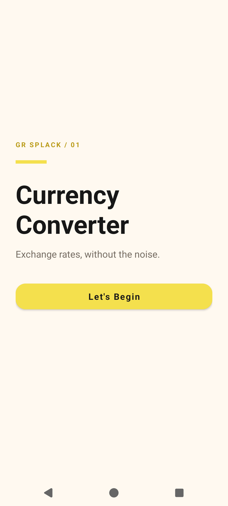
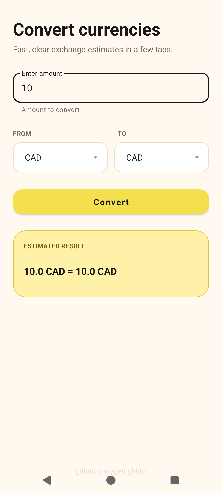

# Currency Converter

A focused Android currency converter with a warm Material interface, live exchange-rate estimates, and full light and dark theme support.

<p align="center">
  
  
</p>

## Features

- Live currency conversion through the APILayer Exchange Rates Data API
- Same-currency conversion without an unnecessary network request
- Clear loading, success, and inline error states
- Light and dark themes
- Connectivity awareness
- Animated splash and navigation transitions
- Release shrinking and obfuscation with R8

## Built with

- Kotlin and XML layouts
- Material Components and ConstraintLayout
- MVVM with a repository layer
- StateFlow and Kotlin coroutines
- Retrofit, OkHttp, and Gson
- Dagger Hilt with KSP
- Jetpack Navigation with Safe Args
- View Binding
- Gradle Kotlin DSL

## Requirements

- Android Studio with JDK 25
- Android SDK 37
- An APILayer Exchange Rates Data API key
- Android 8.0 (API 26) or newer for the target device

## Setup

1. Clone the repository:

   ```bash
   git clone git@github.com:GetRighhttt/CurrencyConverter.git
   cd CurrencyConverter
   ```

2. Add your credentials to the ignored `local.properties` file:

   ```properties
   MY_KEY=your_api_key
   BASE_URL=https://api.apilayer.com/exchangerates_data/
   ```

   Gradle properties (`-PMY_KEY` and `-PBASE_URL`) and environment variables with the same names are also supported for CI builds.

3. Open the project in Android Studio and run the app, or build it from the command line:

   ```bash
   ./gradlew assembleDebug
   ```

> [!NOTE]
> `local.properties` prevents credentials from being committed, but an API key embedded in a client app can still be extracted. A production app should make authenticated requests through a backend service.

## Verification

Run the unit tests and Android lint checks:

```bash
./gradlew test lintDebug
```

## Contact

Questions or comments: **stefanbusiness95@gmail.com**
